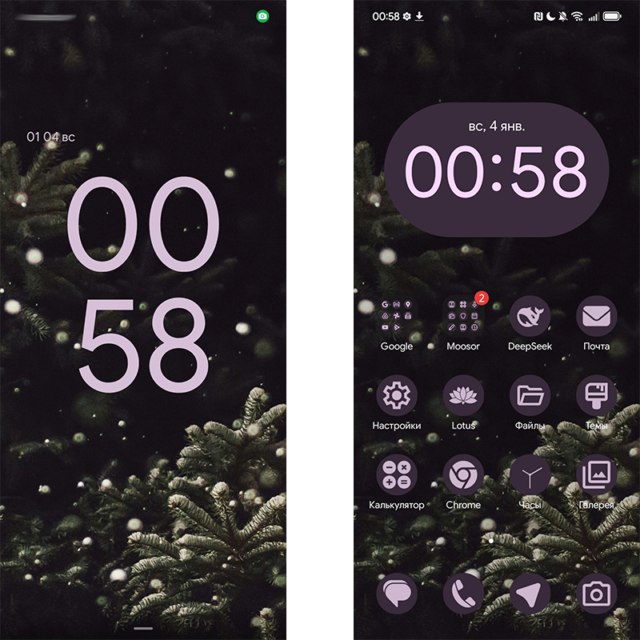
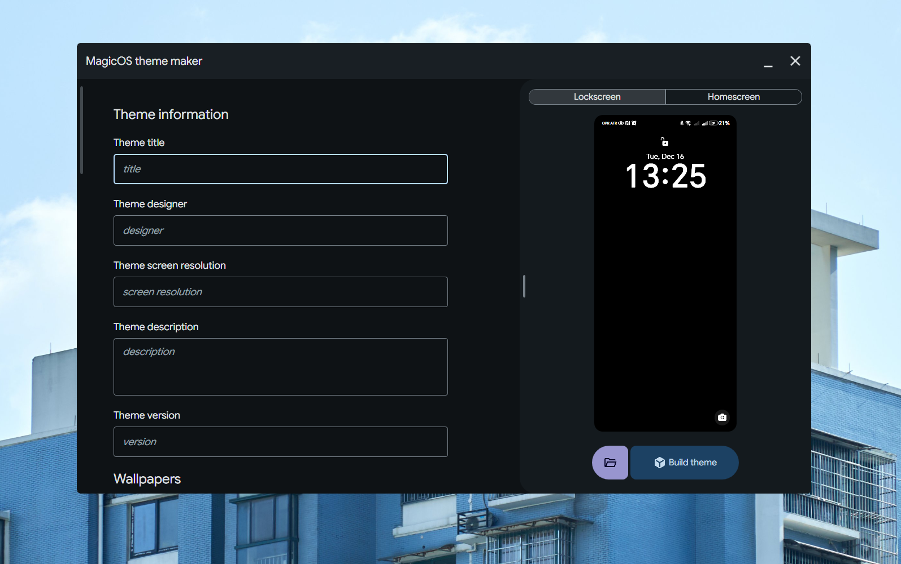

# MagicOSThemeMaker

### App that can create themes for MagisOS (and possibly for EMUI) written on C# (.NET Framework 4.8) with WPF.
So, since in MagicOS was no Material You, and still was old, rusty theme engine, i made this app. But material 3 is not limit!

All of UI was made from scratch, and colors fetches from windows accent color. :3

> [!NOTE]
> Why there is no code?
> Because im too shy to show this mess, this project is my first, an maybe one day i upload it here. :D

## What you can achieve with this tool:

## UI:

### NuGet libs used:
- PixiEditor.ColorPicker
- SharpZipLib
- Microsoft-WindowsAPICodePack-Core
- Microsoft.Toolkit.Uwp.Notifications
- (+ some dependencies)
